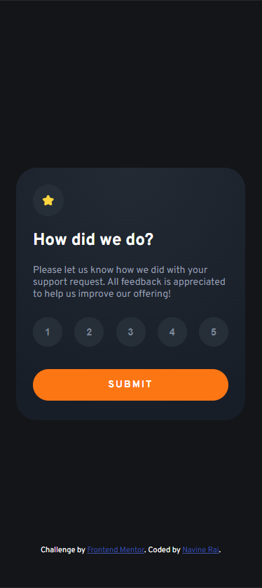

# Frontend Mentor - Interactive rating component solution

This is a solution to the [Interactive rating component challenge on Frontend Mentor](https://www.frontendmentor.io/challenges/interactive-rating-component-koxpeBUmI). Frontend Mentor challenges help you improve your coding skills by building realistic projects. 

## Table of contents

- [Overview](#overview)
  - [The challenge](#the-challenge)
  - [Screenshot](#screenshot)
  - [Links](#links)
- [My process](#my-process)
  - [Built with](#built-with)
  - [What I learned](#what-i-learned)
  - [Continued development](#continued-development)
  - [Useful resources](#useful-resources)
- [Author](#author)

## Overview

### The challenge

Users should be able to:

- View the optimal layout for the app depending on their device's screen size
- See hover states for all interactive elements on the page
- Select and submit a number rating
- See the "Thank you" card state after submitting a rating

### Screenshot

### Links

- Solution URL: [My Code](https://github.com/rainSaxFrontend-Mentor-Projects/Interactive-rating-component)
- Live Site URL: [Github Pages hosted site](https://rainsaxfrontend-mentor-projects.github.io/Interactive-rating-component/)

## My process

### Built with

- Semantic HTML5 markup
- Flexbox
- SCSS

### What I learned

This was my first frontend mentor project using javascript. I got some practice using query selectors, creating and calling functions, and passing elements to them for changing their properties. Additionally, it was also my first project using SCSS and I explored it's nesting functionality.

### Continued development

For continued development, I would like to play around with the rating selectors to try and make it so that once a number is selected, it no longer triggers the on hover event.

### Useful resources

- [Fluid Typography calc](https://royalfig.github.io/fluid-typography-calculator/) - Very useful tool in generation of clamp function.

## Author

- Frontend Mentor - [@rainSax](https://www.frontendmentor.io/profile/rainSax)